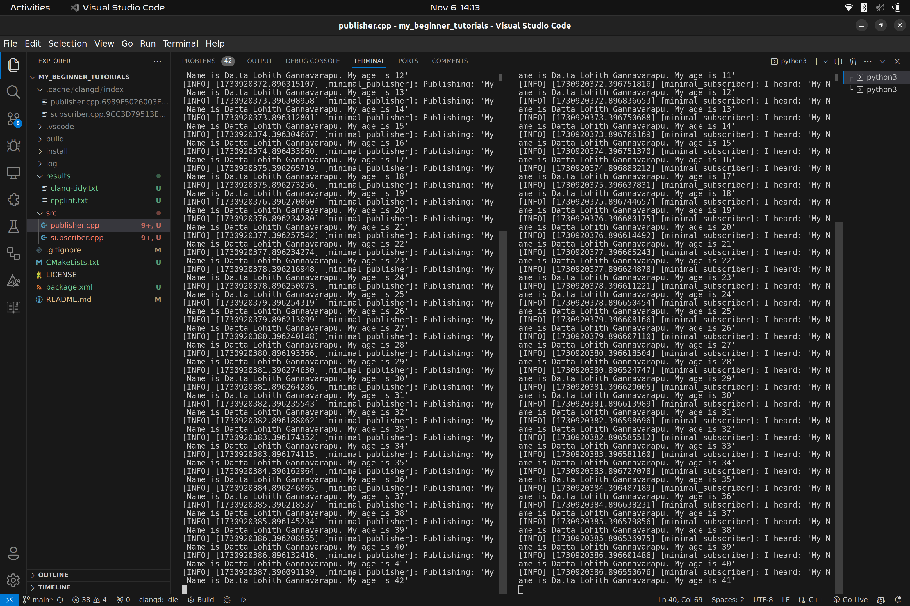

# my_beginner_tutorials
ENPM700 ROS2 Programming Assignment

This repository contains basic ROS2 tutorials involving the creation and use of publisher and subscriber member functions in C++ with ROS2.

## Directory Structure

```
my_beginner_tutorials/
├── src/
│   ├── publisher.cpp  # Publisher node that demonstrates ROS2 C++ publishing
│   ├── subscriber.cpp # Subscriber node that demonstrates ROS2 C++ subscription
├── results/
|   ├── clang-tidy.txt # Output generated by clang-tidy command
|   ├── cpplint.txt # Output generated by cpplint command
|   ├── output.png # Terminal Output
├── .gitignore
├── CMakeLists.txt
├── package.xml
├── LICENSE
├── README.md
```

### `publisher.cpp`

This file contains a basic ROS2 C++ publisher node that demonstrates the use of a publisher for sending messages.

### `subscriber.cpp`

This file contains a basic ROS2 C++ subscriber node that demonstrates the use of a subscriber to receive messages.

## ROS2 Dependencies

- **rclcpp**: ROS Client Library for C++.
- **std_msgs**: Standard message types for ROS, such as strings and integers.
- Other relevant dependencies (for building ROS2 nodes).

Make sure to install the ROS2 Humble version or the appropriate ROS2 distribution on your system and source the ROS2 setup script.

## How to Build and Run

In the root directory of this repository, use the following commands to build the ROS2 package:

```bash
colcon build --packages-select beginner_tutorials
```

### How to Run the Nodes

After building the package, run the publisher and subscriber nodes using the following commands:

1. **Run the publisher node:**
   ```bash
   ros2 run beginner_tutorials talker
   ```

2. **Run the subscriber node:**
   ```bash
   ros2 run beginner_tutorials listener
   ```

Ensure that the ROS2 environment is properly sourced before running the nodes.

## Static Code Analysis with `clang-tidy` and `cpplint`

We use static analysis tools to ensure code quality and consistency. Below are the commands to run these tools.

### `clang-tidy` Command

Run `clang-tidy` with the following command to check for potential issues in the code:

```bash
clang-tidy -p ./build --extra-arg=-stdlib=libc++ --extra-arg=-I/usr/include/c++/11 --extra-arg=-I/usr/include/x86_64-linux-gnu/c++/11 src/*.cpp &> results/clang-tidy.txt
```

- **`-p ./`**: Specifies the location of the `compile_commands.json` file.
- **`--extra-arg=-stdlib=libc++`**: Specifies the standard library to be used for analysis (in this case, `libc++`).
- **`--extra-arg=-I/usr/include/c++/11` and `--extra-arg=-I/usr/include/x86_64-linux-gnu/c++/11`**: Adds the necessary include paths for the C++ standard library and architecture-specific directories.
- **`src/*.cpp`**: Finds all `.cpp` files in the src folder.

### `cpplint` Command

Run `cpplint` to check the style of the C++ code using this command:

```bash
cpplint --filter=-build/c++11,+build/c++17,-build/namespaces,-build/include_order  src/*.cpp >  results/cpplint.txt;
```

- **`cpplint`**: This is the command-line tool for checking C++ code style against Google’s C++ style guide. It flags potential style violations to help maintain consistent code style.

- **`--filter=<rules>`**: The `--filter` flag allows you to include or exclude specific linting rules. Each rule is prefixed with `+` (to include) or `-` (to exclude).

  - **`-build/c++11`**: Excludes rules that enforce C++11 standard practices, allowing more modern C++ standards to be used without warnings.

  - **`+build/c++17`**: Includes rules specific to the C++17 standard, so code is checked against C++17 best practices.

  - **`-build/namespaces`**: Disables checks for namespace style issues, which might be useful if your project has specific namespace conventions.

  - **`-build/include_order`**: Disables checks for include order rules, which can be helpful if your project has a custom include ordering.

- **`src/*.cpp`**: Specifies all `.cpp` files in the `src` directory as the input files for linting.

- **`> results/cpplint.txt`**: Redirects the output of the linting results to a file called `cpplint.txt` in the `results` directory. This allows you to review linting feedback later without cluttering the terminal output.

This command runs `cpplint` on all `.cpp` files in the `src` directory, applies specific filters to customize the linting rules, and saves the output to `results/cpplint.txt`.

## Terminal output

Below is an example of the terminal output after running the publisher and subscriber nodes:




## Additional Notes

- Make sure to have ROS2 dependencies installed and the ROS2 workspace properly set up before building and running the project.
- If you encounter any issues, ensure your system has all required tools (`clang-tidy`, `cpplint`, `colcon`, etc.) installed and that you are working in a properly sourced ROS2 environment.
